# laboratoriocpi

This is a web app for a clinic laboratory with the domain: www.laboratoriocpi.com
The development is made up by:
  - Frontend: Wordpress and HTML-CSS-JS personalized programming
  - Backend: PHP with Laravel
  - IT structure: AWS instance server for the development cap and traditional hosting for the production final cap. It incorporates relational databases with MySQL

The main page/screen is shown in the below picture
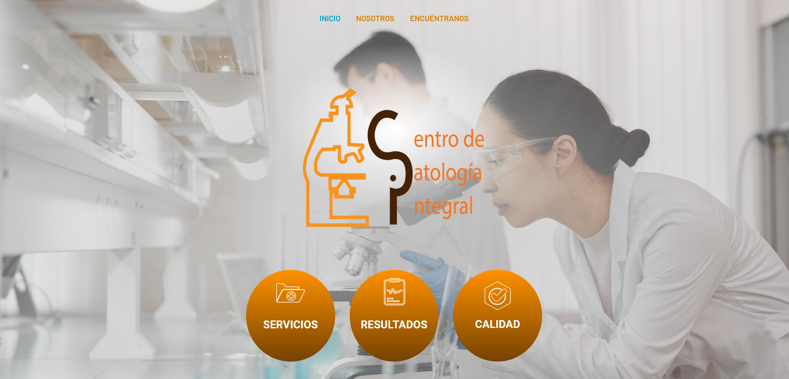

It is made up for a clasic informative web side with three screens. The first is the before shown picture and it contains the CRUD system api rest with two options "Resultados" and "Calidad". The screen "Servicios" is another informative page.

The second page includes social info company as is shown in the next pictures.

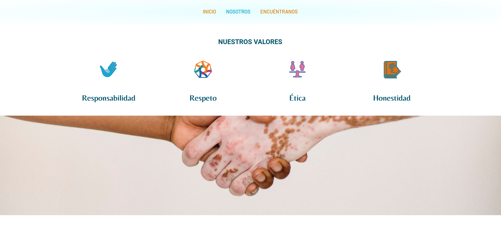
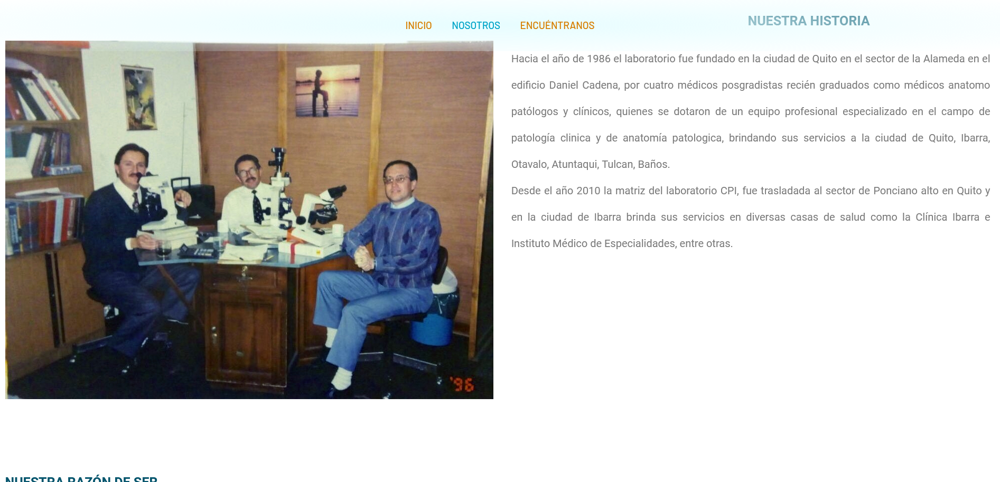

The third main page includes location info, attention schedule and a personal queries.

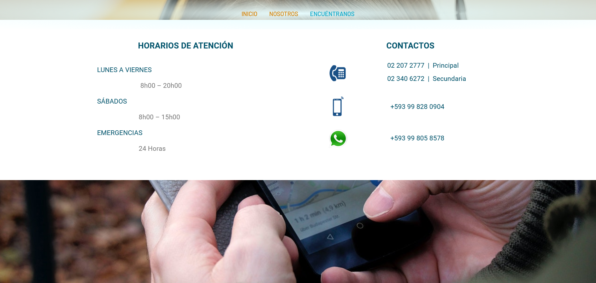
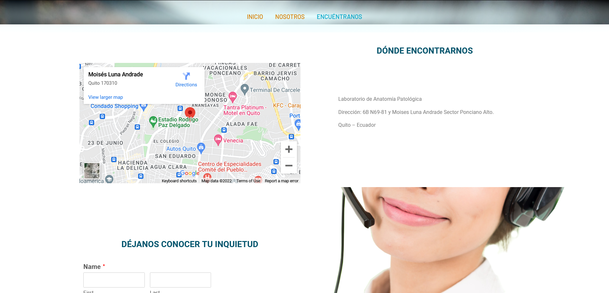

The "Servicios" function option in the main page includes all the clinic exam areas offered by the laboratory

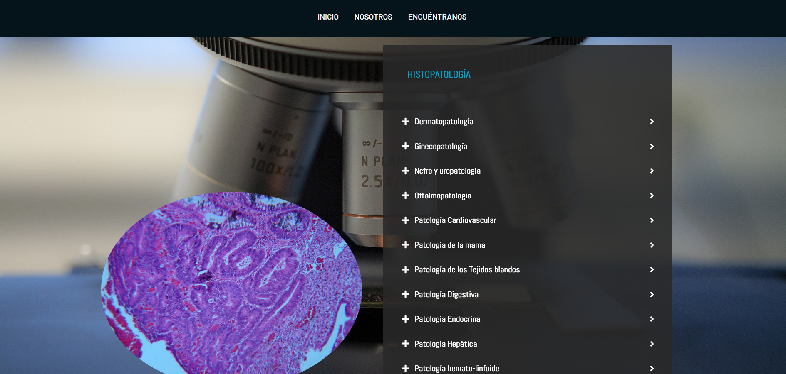
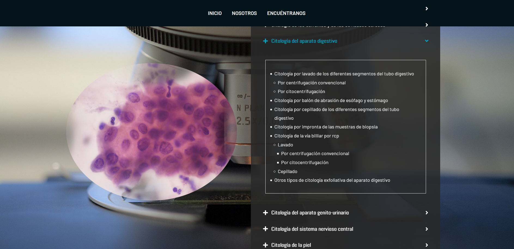

The CRUD system is similar for both "Resultados" and "Calidad". The firt screen shown is the authentication api.

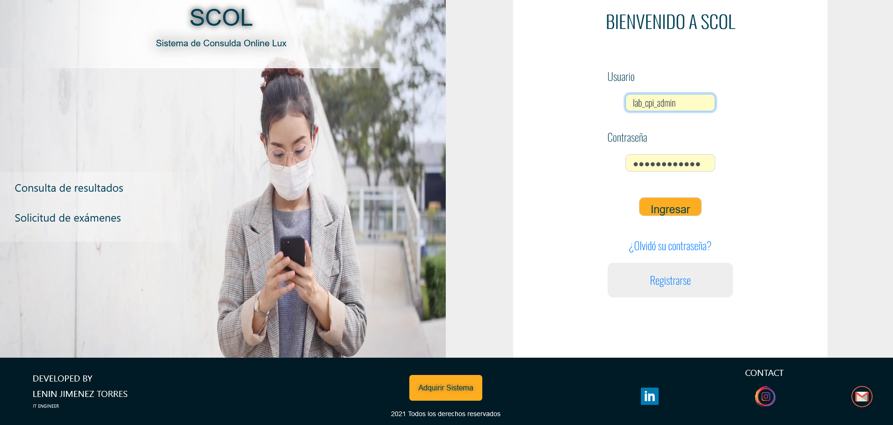

The main crud page shows the abstract of each doctor users registered.

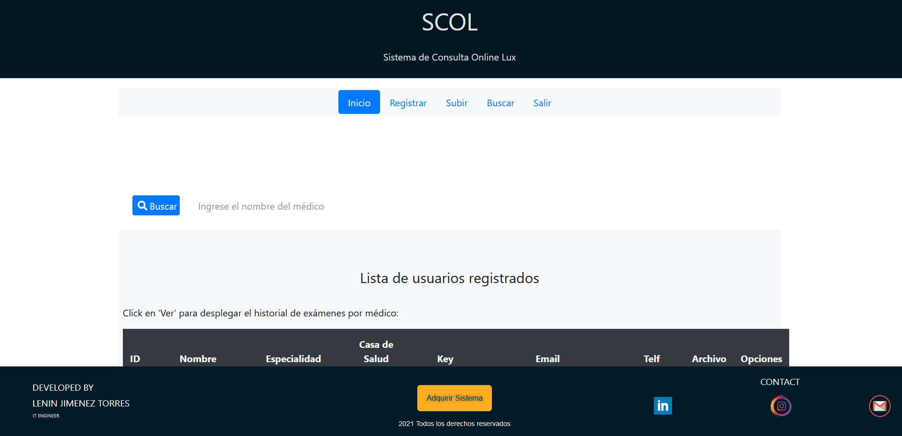
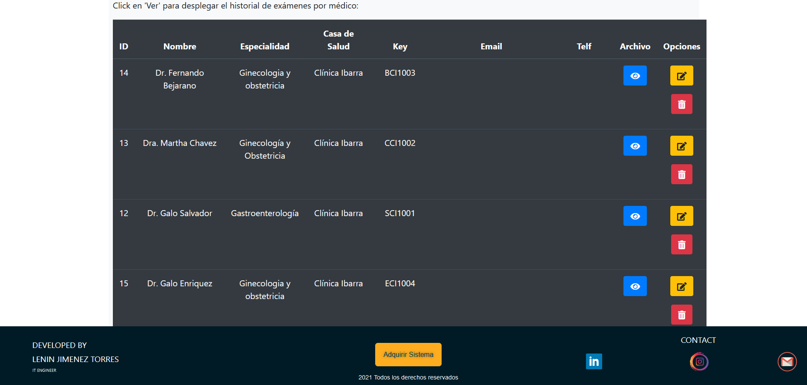

The next page shows the user register api for the admin who can do it. This form validate each data for both frontend and backend preventing possible injections

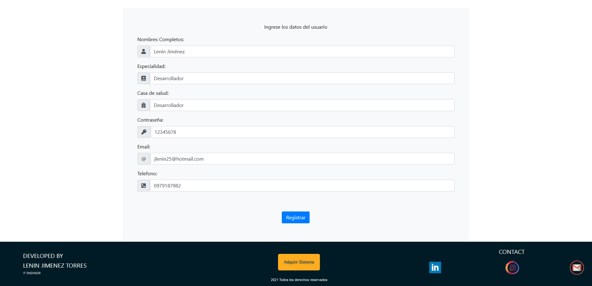

In the next page allows upload the file of the result exam. It form includes doctor info and patient info.

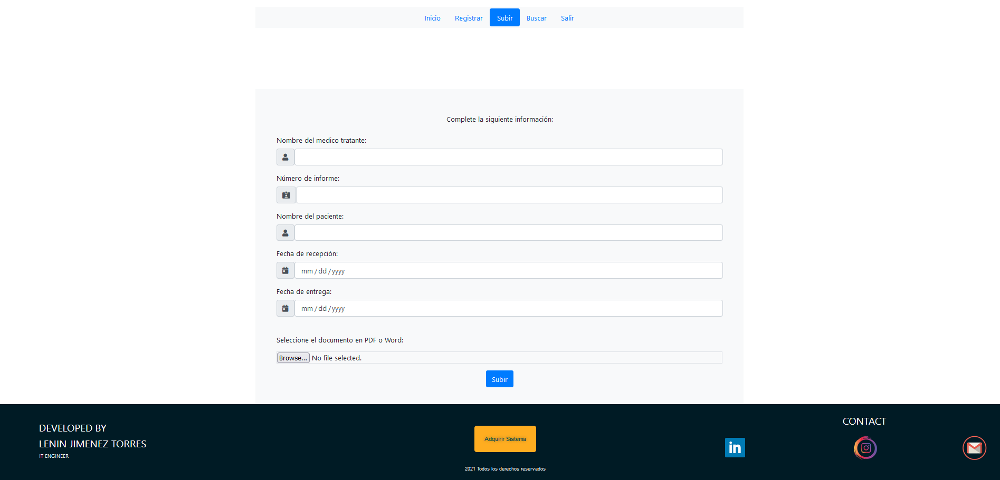

In the next paage you can search information of each patien or all exam uploades by a specific doctor.

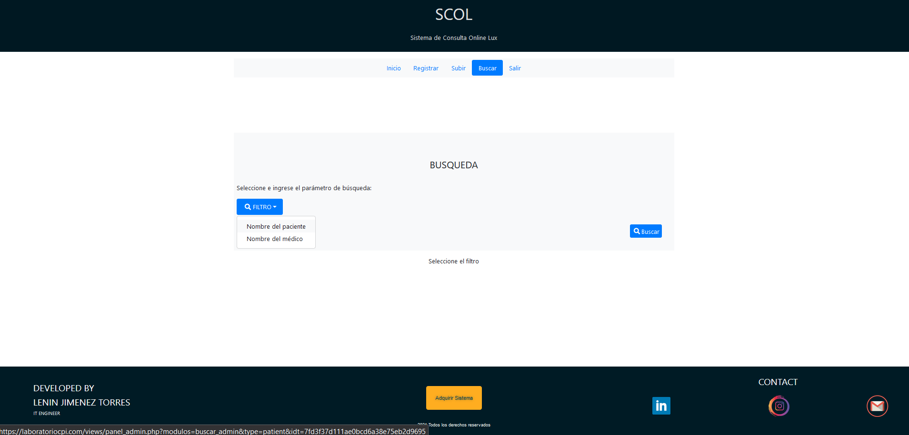
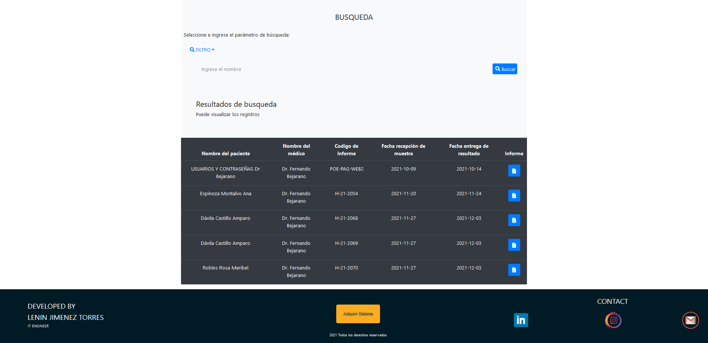

